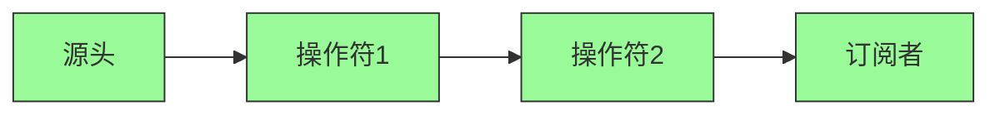
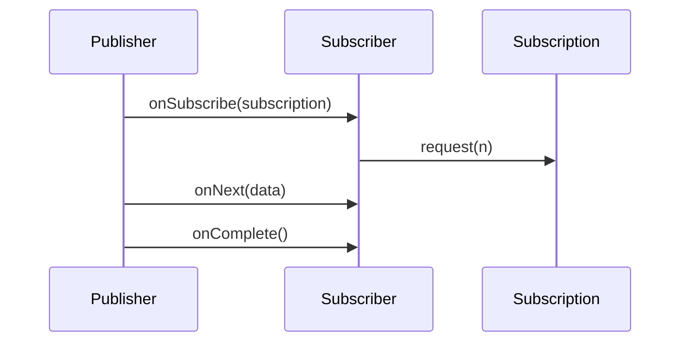

# Reactor 生命周期管理详解

本文将深入解析 Reactor 的生命周期管理机制，包括核心组件、订阅过程和运行时行为，帮助开发者更好地理解响应式流的完整生命周期。

## Reactor 核心组件

### 1. 发布者（Publisher）
- **Flux<T>**：表示 0 到 N 个元素的异步序列
- **Mono<T>**：表示 0 或 1 个元素的异步结果
- **核心作用**：
  - 数据流的源头
  - 支持背压处理
  - 提供丰富的操作符链

### 2. 操作符（Operators）
- **创建操作符**：just, fromIterable, range 等
- **转换操作符**：map, flatMap, filter 等
- **组合操作符**：merge, zip, concat 等
- **错误处理操作符**：onErrorResume, retry 等

### 3. 订阅者（Subscriber）
- **核心方法**：
  - `onSubscribe()`：订阅初始化
  - `onNext()`：接收数据
  - `onError()`：处理异常
  - `onComplete()`：流结束
- **背压支持**：通过 `request(n)` 控制流量

### 4. 调度器（Scheduler）
- **作用**：控制任务执行的线程
- **主要类型**：
  - [Schedulers.immediate()](file://reactor/core/scheduler/Schedulers.java#L59-L59)
  - [Schedulers.single()](file://reactor/core/scheduler/Schedulers.java#L96-L96)
  - [Schedulers.boundedElastic()](file://reactor/core/scheduler/Schedulers.java#L57-L57)
  - [Schedulers.parallel()](file://reactor/core/scheduler/Schedulers.java#L58-L58)

## 生命周期阶段

### 1. 创建阶段

#### 1.1 发布者创建
```java
Flux<String> flux = Flux.just("A", "B", "C");
```
- 创建 Flux 实例
- 初始化数据源
- 设置初始操作符链

#### 1.2 操作符链构建
```java
Flux<String> processedFlux = flux
    .map(String::toUpperCase)
    .filter(s -> s.length() > 1)
    .delayElements(Duration.ofMillis(100));
```
- 构建操作符链
- 每个操作符返回新的 Flux 实例
- 操作符按顺序应用

### 2. 订阅阶段

#### 2.1 订阅初始化
```java
processedFlux.subscribe(
    data -> System.out.println("Received: " + data),
    error -> System.err.println("Error: " + error),
    () -> System.out.println("Done")
);
```
- 调用 `subscribe()` 方法
- 创建 Subscriber 实例
- 触发订阅流程

#### 2.2 背压协商
1. **订阅建立**：Subscriber 通过 `onSubscribe()` 接收 Subscription
2. **请求初始化**：Subscriber 调用 `request(n)` 指定初始请求数
3. **流量控制**：Publisher 根据请求数量发送数据

### 3. 执行阶段

#### 3.1 数据流处理
1. **数据生成**：Publisher 生成数据元素
2. **操作符应用**：按操作符链逐个处理
3. **背压传播**：每个操作符维护请求计数
4. **错误传播**：异常向下游传播

#### 3.2 线程切换


1. **默认线程**：在订阅线程执行
2. **线程切换**：通过 `subscribeOn()` 指定源头线程
3. **后续切换**：通过 `publishOn()` 改变后续操作符线程

### 4. 终止阶段

#### 4.1 正常完成
- **onComplete() 调用**：流正常结束
- **资源释放**：取消订阅，释放相关资源
- **线程池关闭**：自动关闭调度器线程池

#### 4.2 异常终止
- **onError() 调用**：传播异常信息
- **错误处理**：通过 onErrorResume 等操作符处理
- **资源清理**：自动取消订阅并释放资源

#### 4.3 主动取消
```java
Disposable disposable = flux.subscribe();
disposable.dispose(); // 主动取消订阅
```
- **取消订阅**：调用 `dispose()`
- **背压取消**：通过 Subscription 取消
- **资源释放**：清理线程和资源

## 生命周期管理

### 1. 组件交互


### 2. 资源管理
1. **自动清理**：流完成后自动释放资源
2. **手动清理**：通过 Disposable 主动取消
3. **线程池管理**：
   - boundedElastic 线程超时回收
   - parallel 线程永不回收
   - single 线程全局复用

### 3. 生命周期钩子
- **doOnSubscribe**：订阅时触发
- **doOnRequest**：请求时触发
- **doOnNext**：接收数据时触发
- **doOnError**：错误时触发
- **doOnComplete**：完成时触发
- **doOnDispose**：订阅取消时触发

## 生命周期示例分析

### 示例代码回顾
```java
@GetMapping(value = "/lifecycle-example", produces = MediaType.TEXT_EVENT_STREAM_VALUE)
public Flux<String> lifecycleExample() {
    return Flux.range(1, 5)
            .map(i -> "数据 " + i)
            .publishOn(Schedulers.boundedElastic())
            .map(data -> {
                simulateProcessing(data);
                return data + " 已处理";
            });
}
```

### 生命周期流程

#### 1. 创建阶段
1. **Flux 创建**：`Flux.range(1, 5)` 创建数据流
2. **操作符链**：
   - `map()` 转换数据格式
   - `publishOn()` 切换线程
   - `map()` 进一步处理

#### 2. 订阅阶段
1. **订阅触发**：当客户端连接时触发订阅
2. **背压协商**：客户端初始请求 32 个元素
3. **Worker 创建**：从 boundedElastic 获取 Worker

#### 3. 执行阶段
1. **数据生成**：
   - `range(1, 5)` 生成 1-5 数据
   - 初始 map 转换
2. **线程切换**：
   - publishOn 切换到 boundedElastic
   - 新的线程池处理后续操作
3. **数据处理**：
   - simulateProcessing() 模拟处理
   - 第二个 map 转换

#### 4. 终止阶段
1. **完成传播**：
   - 源数据流完成后
   - 所有操作符完成
   - 最终调用 onComplete()
2. **资源释放**：
   - Worker 归还到线程池
   - boundedElastic 线程空闲回收
   - 订阅关系解除

## 生命周期管理最佳实践

### 1. 资源清理
- **及时取消**：不再需要时主动调用 `dispose()`
- **背压控制**：合理设置请求数量
- **线程池管理**：避免内存泄漏

### 2. 错误处理
- **优雅降级**：使用 onErrorResume 提供默认值
- **重试机制**：使用 retry 操作符
- **错误传播**：确保异常正确传递

### 3. 性能优化
- **避免过度订阅**：复用已有的流
- **合理使用背压**：根据处理能力调整请求数量
- **线程切换优化**：减少不必要的线程切换

### 4. 调试技巧
- **日志记录**：使用 doOnNext 等操作符记录关键点
- **线程追踪**：记录线程名称以便调试
- **流验证**：使用 StepVerifier 验证流行为

## 生命周期总结

| 阶段 | 关键操作 | 资源管理 | 背压处理 | 异常处理 |
|------|---------|---------|---------|---------|
| 创建 | Flux/Mono 创建 | 自动分配 | 无 | 无 |
| 订阅 | subscribe() 调用 | Worker 分配 | request(n) | onSubscribe() |
| 执行 | 数据流处理 | 线程池使用 | 请求计数更新 | onError() 传播 |
| 终止 | onComplete/onError | Worker 释放 | 背压完成 | 资源清理 |

理解 Reactor 的生命周期管理对于编写健壮的响应式应用至关重要。通过合理管理订阅、正确处理背压和异常，可以构建高效、稳定的响应式系统。