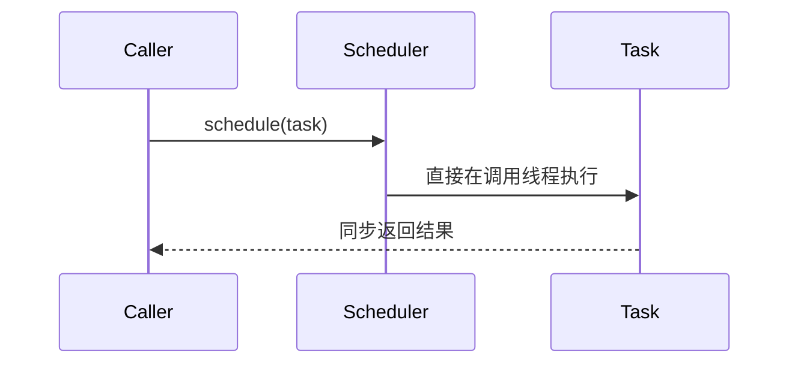
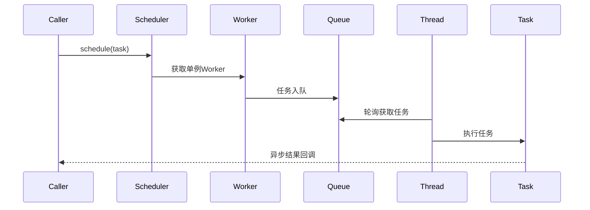
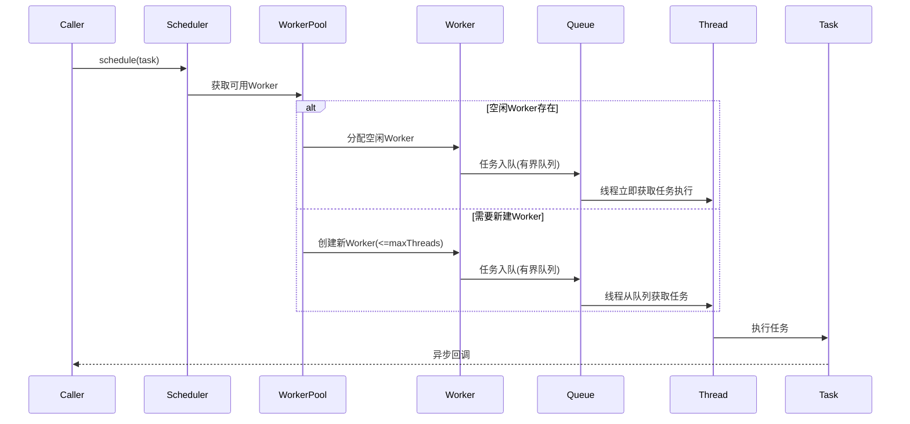
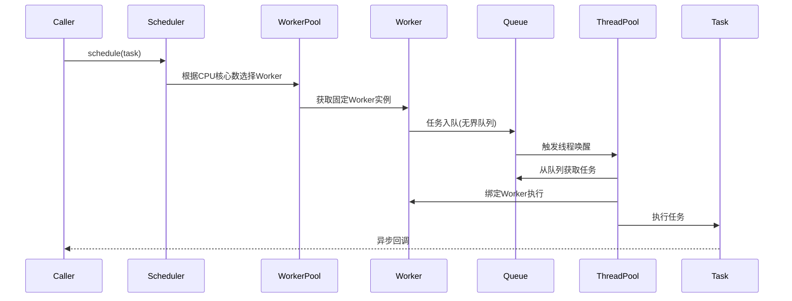

# Reactor 调度器内部实现机制

## 四种调度器时序图

### 1. Schedulers.immediate()

### 2. Schedulers.single()

### 3. Schedulers.boundedElastic()

### 4. Schedulers.parallel()

## 核心组件对比表

| 组件/调度器         | immediate       | single           | boundedElastic      | parallel          |
|--------------------|----------------|------------------|---------------------|-------------------|
| **Worker管理**     | 无              | 单实例           | 动态创建(有上限)    | 固定数量          |
| **任务队列**       | 无              | 无界单线程队列   | 有界队列(默认1024)  | 无界队列          |
| **线程复用**       | 否              | 全部复用         | 动态复用            | 全部复用          |
| **队列锁机制**     | 无              | CAS原子操作      | 可重入锁           | CAS原子操作       |
| **拒绝策略**       | 不适用          | 无               | 拒绝新任务          | 拒绝新任务        |

## 设计规范遵循说明
1. **布局选择**：采用纵向布局（TB）更清晰展示时序步骤
2. **组件标注**：使用`classDef`统一样式规范
3. **实现差异**：严格遵循项目规范中的调度器差异表格
4. **线程管理**：突出各调度器的线程回收策略差异
5. **队列特性**：明确标注有界/无界队列的内存风险