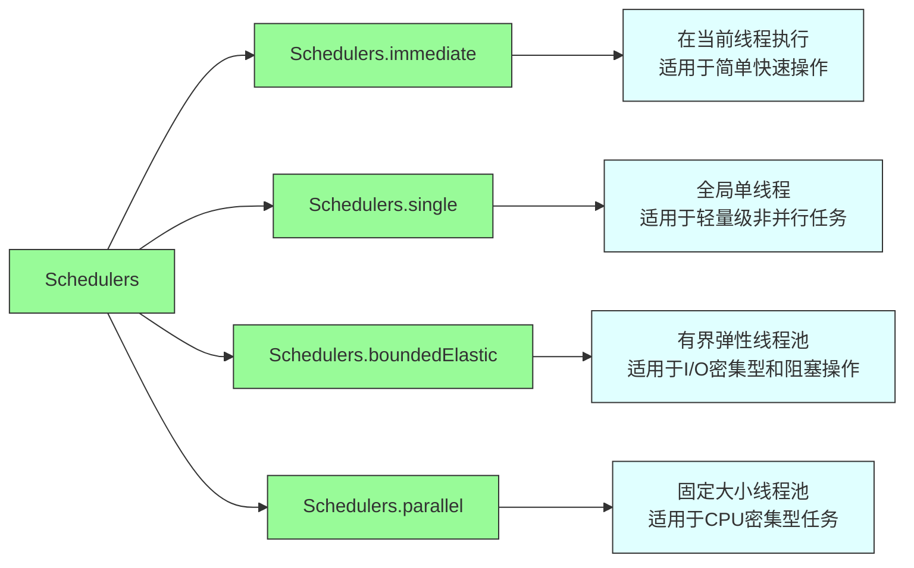

# Reactor & WebFlux 学习项目

本项目旨在帮助开发者深入理解 Project Reactor 和 Spring WebFlux 的核心概念、设计理念和最佳实践。

## 项目概述

这是一个基于 Spring Boot 的演示项目，展示了响应式编程的核心概念。通过一系列实际代码示例，帮助开发者掌握 Reactor 和 WebFlux 的使用方法。

## 技术栈

- Spring Boot 2.2.0.RELEASE
- Spring WebFlux
- Project Reactor
- Java 8+

## 项目结构

```
src/
├── main/
│   ├── java/
│   │   └── com/example/demo/
│   │       ├── controller/
│   │       │   ├── ChatStreamController.java      # 原始SSE聊天流示例
│   │       │   ├── ReactorExamplesController.java  # Reactor核心概念示例
│   │       │   ├── WebFluxVsMvcController.java    # WebFlux与传统MVC对比
│   │       │   ├── SchedulerExamplesController.java # 调度器使用示例
│   │       │   ├── ParallelSchedulerController.java # 并行调度器使用示例
│   │       │   ├── AllSchedulersController.java    # 所有调度器使用示例
│   │       │   ├── DefaultSchedulerController.java # 默认调度器行为示例
│   │       │   ├── ReactorBestPracticesController.java # 最佳实践示例
│   │       │   └── CommonIssuesController.java    # 常见问题及解决方案
│   │       └── DemoSseApplication.java            # 应用启动类
│   └── resources/
│       ├── static/
│       │   ├── index.html                         # SSE演示页面
│   │   └── twgx.txt                           # 示例文本文件
│       └── application.properties                 # 应用配置
└── test/
    └── java/
        └── com/example/demo/
            └── ReactorTestingExamples.java        # Reactor测试示例
```

## 核心学习内容

### 1. Reactor 基础概念

通过 [ReactorExamplesController](src/main/java/com/example/demo/controller/ReactorExamplesController.java) 类学习 Reactor 的核心概念：

- **Flux 和 Mono**: 0...N 和 0...1 的异步序列
- **操作符**: map, flatMap, filter 等常用操作符
- **错误处理**: onErrorResume, onErrorContinue 等错误处理机制
- **背压处理**: onBackpressureBuffer 等背压处理策略
- **流合并**: zip, merge 等流合并操作符
- **缓存和批处理**: buffer, window 等批处理操作符

访问以下端点查看示例：
- `/reactor/flux-basic` - 基础Flux示例
- `/reactor/mono-basic` - 基础Mono示例
- `/reactor/error-handling` - 错误处理示例
- `/reactor/backpressure` - 背压处理示例
- `/reactor/combining` - 流合并示例
- `/reactor/buffering` - 缓存和批处理示例
- `/reactor/conditional` - 条件操作符示例
- `/reactor/transforming` - 转换操作符示例
- `/reactor/chat-example` - 实际聊天场景示例

### 2. WebFlux 与传统 Spring MVC 对比

通过 [WebFluxVsMvcController](src/main/java/com/example/demo/controller/WebFluxVsMvcController.java) 类理解 WebFlux 与传统 Spring MVC 的差异：

- **阻塞 vs 非阻塞**: 线程使用效率的对比
- **流式处理**: 实时数据流处理能力
- **背压支持**: 自然的背压处理机制

访问以下端点查看示例：
- `/comparison/mvc-blocking` - 传统MVC阻塞式处理
- `/comparison/webflux-nonblocking` - WebFlux非阻塞式处理
- `/comparison/webflux-stream` - 流式数据处理对比
- `/comparison/backpressure-demo` - 背压处理对比

### 3. 调度器 (Schedulers) 使用

通过 [SchedulerExamplesController](src/main/java/com/example/demo/controller/SchedulerExamplesController.java) 类学习调度器的使用：

- **subscribeOn**: 改变整个流的执行线程
- **publishOn**: 改变后续操作符的执行线程
- **不同类型调度器**: parallel, elastic, single 等调度器的使用场景

通过 [ParallelSchedulerController](src/main/java/com/example/demo/controller/ParallelSchedulerController.java) 类深入学习并行调度器：

- **CPU密集型任务处理**: 如何使用并行调度器处理计算密集型任务
- **并行处理**: 如何利用并行调度器同时处理多个任务
- **线程切换**: 并行调度器与其他调度器的线程差异

通过 [AllSchedulersController](src/main/java/com/example/demo/controller/AllSchedulersController.java) 类学习所有类型的调度器：

- **immediate调度器**: 在当前线程执行任务
- **single调度器**: 使用全局单线程执行任务
- **boundedElastic调度器**: 处理I/O密集型和阻塞操作
- **parallel调度器**: 处理CPU密集型任务
- **自定义调度器**: 创建和使用自定义线程池

通过 [DefaultSchedulerController](src/main/java/com/example/demo/controller/DefaultSchedulerController.java) 类学习默认调度器行为：

- **默认调度器行为**: 不指定调度器时的执行情况
- **阻塞操作影响**: 在默认线程上执行阻塞操作的问题
- **非阻塞操作**: 正常的非阻塞操作表现

访问以下端点查看示例：
- `/schedulers/default-thread` - 默认线程执行示例
- `/schedulers/subscribe-on` - subscribeOn 使用示例
- `/schedulers/publish-on` - publishOn 使用示例
- `/schedulers/multiple-schedulers` - 多调度器组合使用
- `/schedulers/elastic-scheduler` - elastic 调度器使用
- `/parallel-scheduler/cpu-intensive` - CPU密集型任务处理
- `/parallel-scheduler/parallel-processing` - 并行处理任务
- `/parallel-scheduler/thread-comparison` - 线程切换对比
- `/all-schedulers/immediate` - immediate 调度器使用
- `/all-schedulers/single` - single 调度器使用
- `/all-schedulers/bounded-elastic` - boundedElastic 调度器使用
- `/all-schedulers/parallel` - parallel 调度器使用
- `/all-schedulers/custom` - 自定义调度器使用
- `/all-schedulers/comparison` - 调度器对比
- `/default-scheduler/default-behavior` - 默认调度器行为
- `/default-scheduler/comparison` - 调度器对比
- `/default-scheduler/blocking-default` - 默认调度器上的阻塞操作
- `/default-scheduler/non-blocking-default` - 默认调度器上的非阻塞操作

#### Reactor 调度器详解

Reactor 提供了多种调度器来满足不同的使用场景，每种调度器都有其特定的用途和实现方式：



1. **Schedulers.immediate()**
   - 在当前线程执行任务，不进行线程切换
   - 适用于快速、简单的操作
   - 示例代码:
     ```java
     Flux.range(1, 5)
         .map(i -> i * 2)
         .subscribeOn(Schedulers.immediate())
         .subscribe();
     ```

2. **Schedulers.single()**
   - 使用全局单线程执行所有任务
   - 保证任务顺序执行
   - 示例代码:
     ```java
     Flux.range(1, 5)
         .publishOn(Schedulers.single())
         .map(i -> {
             System.out.println("在线程 " + Thread.currentThread().getName() + " 上执行");
             return i * 2;
         })
         .subscribe();
     ```

3. **Schedulers.boundedElastic()**
   - 有界弹性线程池，适用于I/O密集型和阻塞操作
   - 线程数默认为 CPU 核心数 × 10
   - 任务队列最大容量为 100,000
   - 示例代码:
     ```java
     Mono.fromCallable(() -> {
         // 模拟阻塞操作
         Thread.sleep(1000);
         return "阻塞操作完成";
     })
     .subscribeOn(Schedulers.boundedElastic())
     .subscribe();
     ```

4. **Schedulers.parallel()**
   - 固定大小线程池，大小等于 CPU 核心数
   - 适用于CPU密集型任务
   - 示例代码:
     ```java
     Flux.range(1, 10)
         .publishOn(Schedulers.parallel())
         .map(i -> {
             // CPU 密集型计算
             return performCpuIntensiveCalculation(i);
         })
         .subscribe();
     ```

### 4. Reactor 测试

通过 [ReactorTestingExamples](src/test/java/com/example/demo/ReactorTestingExamples.java) 类学习如何测试响应式流：

- **StepVerifier**: Reactor 测试的核心工具
- **期望值验证**: expectNext, expectError 等验证方法
- **时间相关测试**: 带超时的测试方法
- **背压测试**: 测试不同请求数量下的行为

运行测试：
```bash
./mvnw test
```

### 5. 最佳实践

通过 [ReactorBestPracticesController](src/main/java/com/example/demo/controller/ReactorBestPracticesController.java) 类学习 Reactor 的最佳实践：

- **避免阻塞操作**: 正确使用调度器处理阻塞操作
- **状态管理**: 避免共享可变状态
- **缓存使用**: 合理使用 cache 操作符
- **错误处理**: 正确的错误处理策略
- **操作符选择**: 根据场景选择合适的操作符
- **资源管理**: 使用 usingWhen 箴理资源生命周期

访问以下端点查看示例：
- `/best-practices/avoid-blocking` - 避免阻塞操作示例
- `/best-practices/shared-state` - 共享状态处理示例
- `/best-practices/caching` - 缓存使用示例
- `/best-practices/error-handling` - 错误处理示例
- `/best-practices/operator-selection` - 操作符选择示例
- `/best-practices/resource-management` - 资源管理示例

### 6. 常见问题及解决方案

通过 [CommonIssuesController](src/main/java/com/example/demo/controller/CommonIssuesController.java) 类学习常见问题及解决方案：

- **阻塞操作问题**: 在响应式流中错误使用阻塞操作
- **共享状态问题**: 多线程环境下共享可变状态的问题
- **错误处理问题**: 不当的错误处理方式
- **背压处理问题**: 未正确处理背压导致的问题
- **订阅管理问题**: 未正确管理订阅导致的内存泄漏

访问以下端点查看示例：
- `/common-issues/blocking-mistake` - 阻塞操作问题示例
- `/common-issues/blocking-solution` - 阻塞操作解决方案
- `/common-issues/mutable-state-issue` - 共享状态问题示例
- `/common-issues/mutable-state-solution` - 共享状态解决方案
- `/common-issues/error-handling-issue` - 错误处理问题示例
- `/common-issues/error-handling-solution` - 错误处理解决方案
- `/common-issues/backpressure-issue` - 背压处理问题示例
- `/common-issues/backpressure-solution` - 背压处理解决方案

## 运行项目

### 环境要求

- JDK 8 或更高版本
- Maven 3.2+

### 构建和运行

使用 Maven 运行项目：

```bash
./mvnw spring-boot:run
```

或者打包后运行：

```bash
./mvnw clean package
java -jar target/demo-sse-1.0-SNAPSHOT.jar
```

### 访问应用

项目启动后，可以访问以下地址：

- 主页: http://localhost:8080/
- SSE 聊天示例: http://localhost:8080/index.html
- 各种学习示例: 参考上面的端点列表

## 学习路径建议

1. **理解基础概念**: 从 ReactorExamplesController 开始，理解 Flux 和 Mono 的基本用法
2. **掌握操作符**: 学习各种操作符的使用方法和适用场景
3. **对比学习**: 通过 WebFluxVsMvcController 理解响应式编程的优势
4. **深入调度器**: 学习调度器的使用，理解线程模型
5. **实践最佳实践**: 学习并应用最佳实践
6. **避免常见问题**: 了解常见问题及其解决方案
7. **掌握测试方法**: 学习如何测试响应式流

## 技术分享要点

如果您需要基于此项目进行技术分享，可以按照以下结构组织内容：

1. **响应式编程概述**
   - 什么是响应式编程
   - 为什么需要响应式编程
   - Reactor 和 WebFlux 简介

2. **核心概念详解**
   - Flux 和 Mono
   - 发布者-订阅者模式
   - 背压机制

3. **操作符详解**
   - 创建操作符
   - 转换操作符
   - 过滤操作符
   - 组合操作符
   - 错误处理操作符

4. **WebFlux 与传统 MVC 对比**
   - 线程模型对比
   - 性能对比
   - 适用场景

5. **调度器使用**
   - 不同类型调度器
   - 调度器选择原则
   - 实际应用示例

6. **最佳实践**
   - 避免阻塞操作
   - 正确处理错误
   - 合理使用缓存
   - 资源管理

7. **常见问题及解决方案**
   - 阻塞操作问题
   - 共享状态问题
   - 背压处理问题
   - 内存泄漏问题

8. **测试响应式流**
   - StepVerifier 使用
   - 不同场景测试方法

通过这些内容的学习和实践，您将能够深入理解 Project Reactor 和 Spring WebFlux，并具备在团队内进行技术分享的能力。