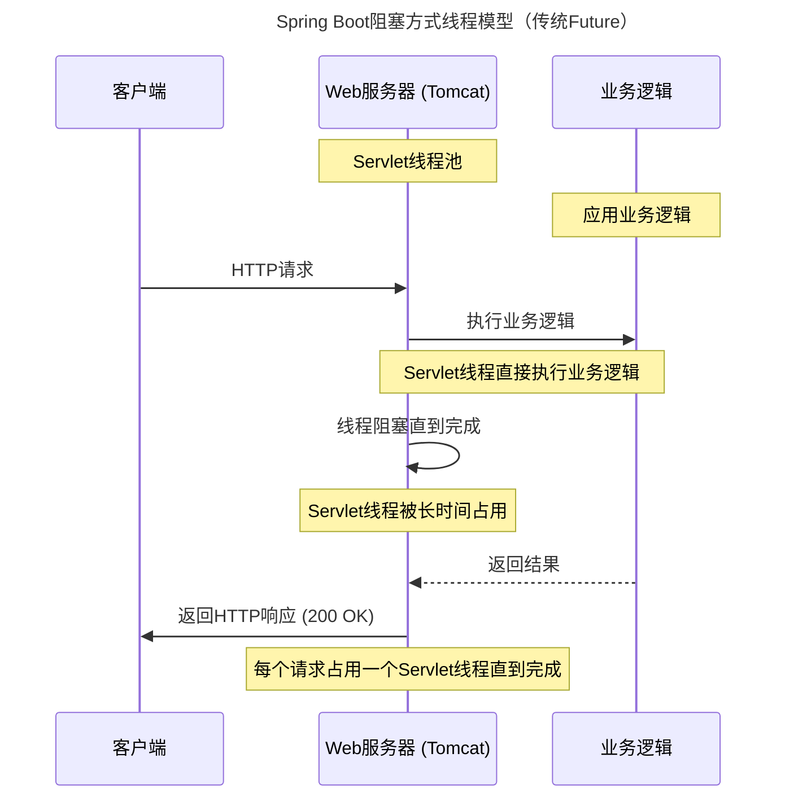
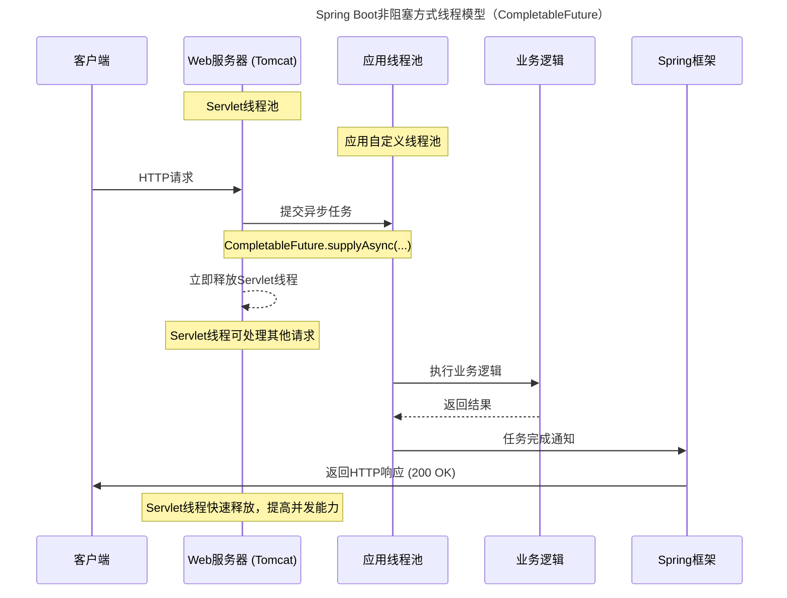
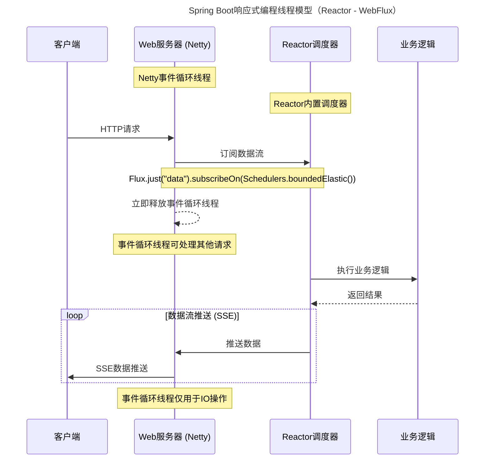
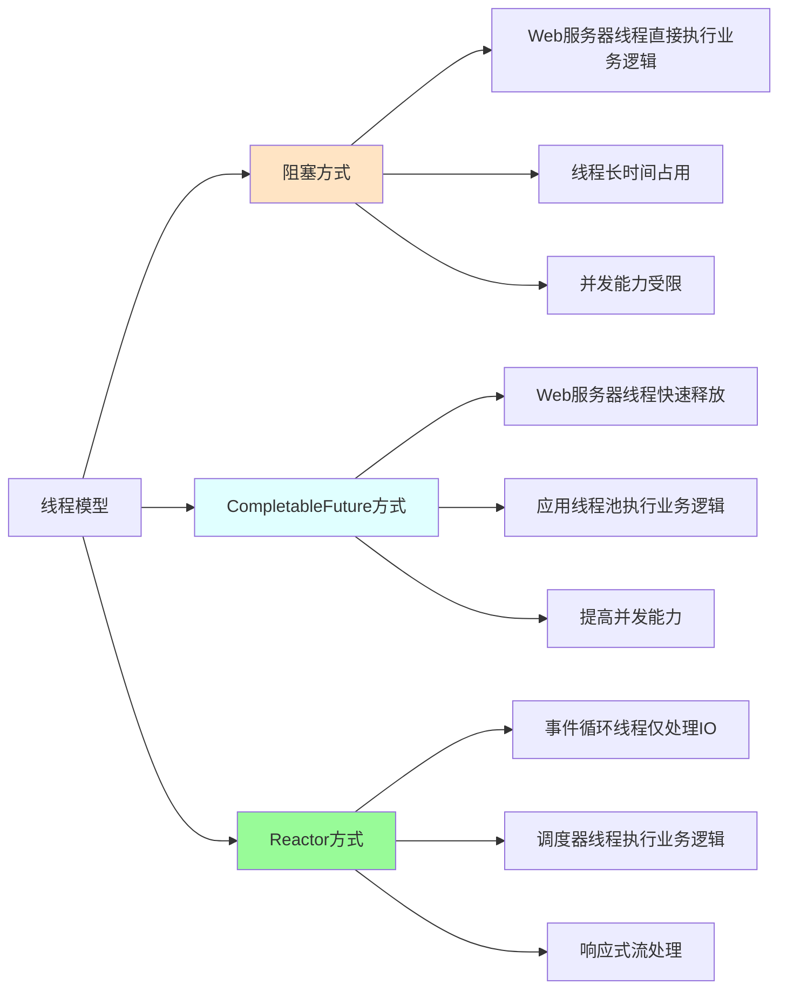

# Spring Boot线程模型详解

## 阻塞方式线程模型（使用Future）



## 非阻塞方式线程模型（使用CompletableFuture）



## 响应式编程线程模型（使用Reactor）



## 线程池配置和使用对比

```mermaid
graph LR
    A[Spring Boot应用] --> B[Web服务器线程池]
    A --> C[应用自定义线程池]
    A --> D[Reactor调度器]
    
    B --> B1["Servlet线程池<br/>(Tomcat)"]
    B --> B2["事件循环线程池<br/>(Netty)"]
    B --> B3[用于接收和<br/>协调HTTP请求]
    
    C --> C1[CompletableFuture<br/>线程池]
    C --> C2[@Async注解<br/>线程池]
    C --> C3[执行耗时<br/>业务逻辑]
    
    D --> D1["Schedulers<br/>.parallel()"]
    D --> D2["Schedulers<br/>.boundedElastic()"]
    D --> D3["Schedulers<br/>.single()"]
    
    D1 --> D11[CPU密集型任务]
    D2 --> D21[I/O密集型任务]
    D3 --> D31[轻量级任务]
    
    style A fill:#f0f8ff,stroke:#333
    style B fill:#ffe4c4,stroke:#333
    style C fill:#e0ffff,stroke:#333
    style D fill:#98fb98,stroke:#333
    
    classDef webServer fill:#ffe4c4,stroke:#333;
    classDef appThreadPool fill:#e0ffff,stroke:#333;
    classDef reactorScheduler fill:#98fb98,stroke:#333;
```

## 线程模型对比



## 实际应用中的线程使用情况

```mermaid
gantt
    title 阻塞方式 vs 非阻塞方式线程使用情况对比
    dateFormat  HH:mm:ss
    axisFormat  %H:%M:%S
    
    section 阻塞方式 - Web服务器线程
    请求1处理: 00:00:00, 3s
    请求2处理: 00:00:00, 3s
    请求3处理: 00:00:00, 3s
    请求4处理: 00:00:00, 3s
    请求5处理: 00:00:00, 3s
    
    section 非阻塞方式 - Web服务器线程
    接收请求1: 00:00:00, 0s
    接收请求2: 00:00:00, 0s
    接收请求3: 00:00:00, 0s
    接收请求4: 00:00:00, 0s
    接收请求5: 00:00:00, 0s
    空闲时间: 00:00:00, 3s
    
    section 非阻塞方式 - 应用线程池
    任务1执行: 00:00:00, 3s
    任务2执行: 00:00:00, 3s
    任务3执行: 00:00:00, 3s
    任务4执行: 00:00:00, 3s
    任务5执行: 00:00:00, 3s
   
```



## 总结

通过以上图表可以清楚地看到不同线程模型的特点：

1. **阻塞方式**：
   - Web服务器线程（Servlet线程/事件循环线程）直接执行业务逻辑
   - 线程被长时间占用，直到请求处理完成
   - 并发处理能力受限于Web服务器线程池大小

2. **CompletableFuture非阻塞方式**：
   - Web服务器线程快速释放，可以处理其他请求
   - 应用自定义线程池执行具体的业务逻辑
   - 提高了系统的并发处理能力

3. **Reactor响应式方式**：
   - Web服务器事件循环线程仅处理IO操作
   - Reactor调度器线程执行业务逻辑
   - 通过响应式流实现高效的异步处理

关键区别：
- **Web服务器线程**：负责接收请求和IO操作，应尽量避免执行耗时业务逻辑
- **应用线程池/调度器线程**：专门用于执行耗时的业务逻辑，不影响Web服务器的并发处理能力