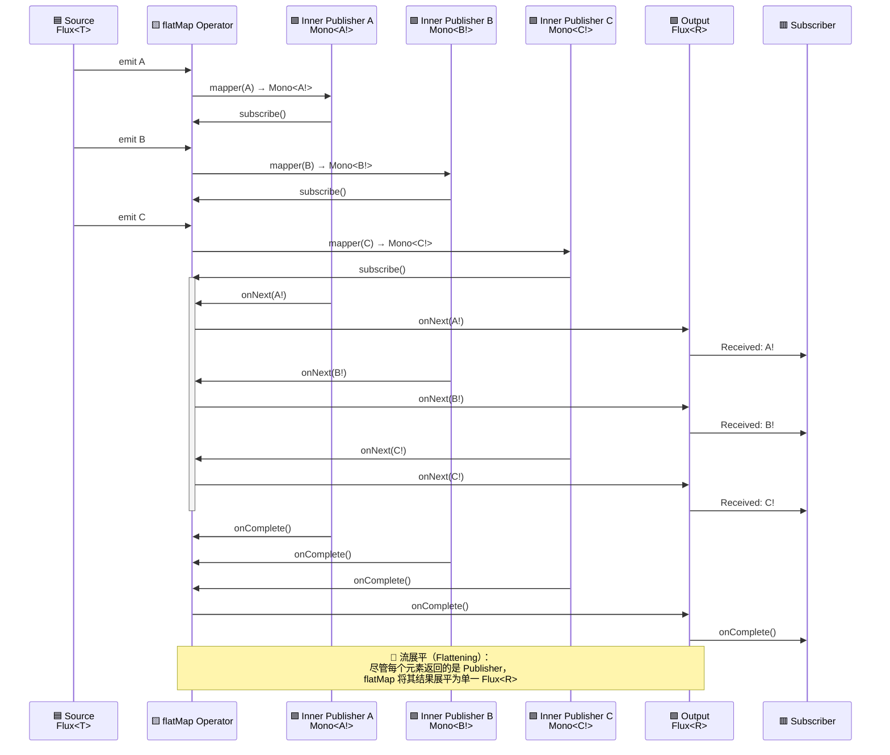

# Reactor

### 简介

reactor是对 响应式编程范式的实现，

响应式编程是一种关注于数据流和变化传递的异步编程方式，可以用于表达静态（如数组）或动态（如事件源）的数据流。

一、响应式编程可以看作是 观察者模式的一种扩展。

传统的观察者模式：

```java
//被观察对象
interface Subject {
  // 多个观察者订阅这个对象
  void addObserver(Observer observer);
  void removerObserver(Observer observer);
  // 被观察对象状态变化，通知所有观察者
  void notifyObservers(String message);
}

// 观察者
interface Observer {
  void dosomething(String message)
}
```

响应式编程的扩展

1、数据流支持：不仅支持单个事件的通知，还支持连续的数据流

2、操作符链：提供丰富的操作符来转换、过滤、组合数据流

3、背压处理：通过背压机制解决生产者和消费者速率不匹配的问题

4、错误处理、完成信号：Publisher可以推送错误/完成信号来终止响应式流。

5、资源管理：更好的资源管理和生命周期控制


二、响应式流和迭代器模式

传统的迭代器模式（PULL），“命令式”（imperative）编程范式

```java
List<String> list = Arrays.asList("a", "b", "c");
Iterator<String> iterator = list.iterator();
while (iterator.hasNext()) {
    String item = iterator.next(); // 主动拉取数据
    System.out.println(item);
}
```

- 消费者主动从数据源拉取数据
- 消费者控制数据获取的节奏

响应式流（PUSH），声明式（declaratively）

- 数据源主动将数据推送给消费者
- 生产者控制数据推送节奏（但受背压机制制约）


三、总结

响应式编程结合了观察者模式和迭代器模式的优点，并在此基础上进行了重要扩展：

- 从观察者模式继承了事件驱动的特性，但增强了数据流处理能力

- 从迭代器模式借鉴了数据遍历的概念，但改变了数据获取方式（Push vs Pull）

- 增加了背压处理、丰富的操作符、完善的错误处理等新特性

这种设计使得响应式编程特别适合处理异步数据流、实时数据处理和高并发场景


### 生命周期


### 调度模型


### 核心操作符

#### flatmap

- **作用**：将 `Flux<T>` 中的每个元素转换为一个 `Publisher<R>`，然后将所有这些“内部流”**并发合并**成一个单一的 `Flux<R>`。
- **核心特性**：异步、展平、并发处理。
- `concurrency`: 并发订阅的 inner publisher 数量（默认 `Queues.SMALL_BUFFER_SIZE`，通常是 256）
- `prefetch`: 每个 inner publisher 预取的元素数量（默认 `Queues.XS_BUFFER_SIZE`，通常是 32）

```java
public final <R> Flux<R> flatMap(Function<? super T, ? extends Publisher<? extends R>> mapper) {
		return flatMap(mapper, Queues.SMALL_BUFFER_SIZE, Queues
				.XS_BUFFER_SIZE);
	}

```


### 核心概念

#### inner publisher

#### 异步展平

> 异步展平是将每个元素触发一个异步任务（返回 Publisher）的过程，通过操作符（如 `flatMap`）自动订阅这些任务，并将它们的结果合并成一个单一、非阻塞、支持背压的输出流。

| **异步（Asynchronous）** | 不阻塞主线程，任务完成后通过事件通知结果                 |
| ------------------------ | -------------------------------------------------------- |
| **展平（Flattening）**   | 把“流的流”（`Flux<Flux<T>>`）变成“单一的流”（`Flux<T>`） |
| **操作对象**             | 每个元素都会触发一个异步任务（返回`Mono<T>`或`Flux<T>`） |


示例：

```java
Flux.just("A", "B", "C")
    .flatMap(s -> Mono.just(s + "!"))
    .subscribe(result -> System.out.println("Received: " + result));
```

