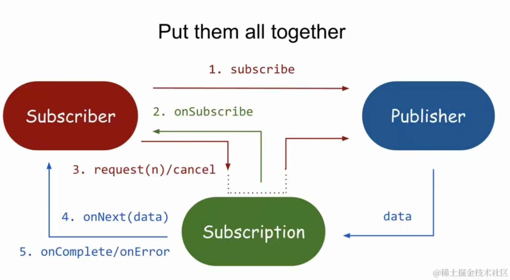
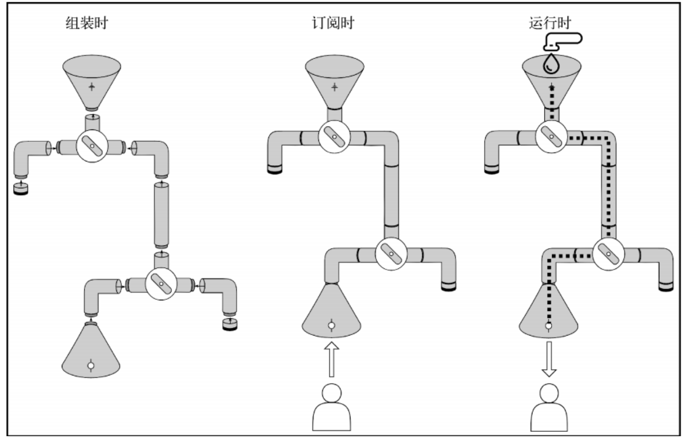
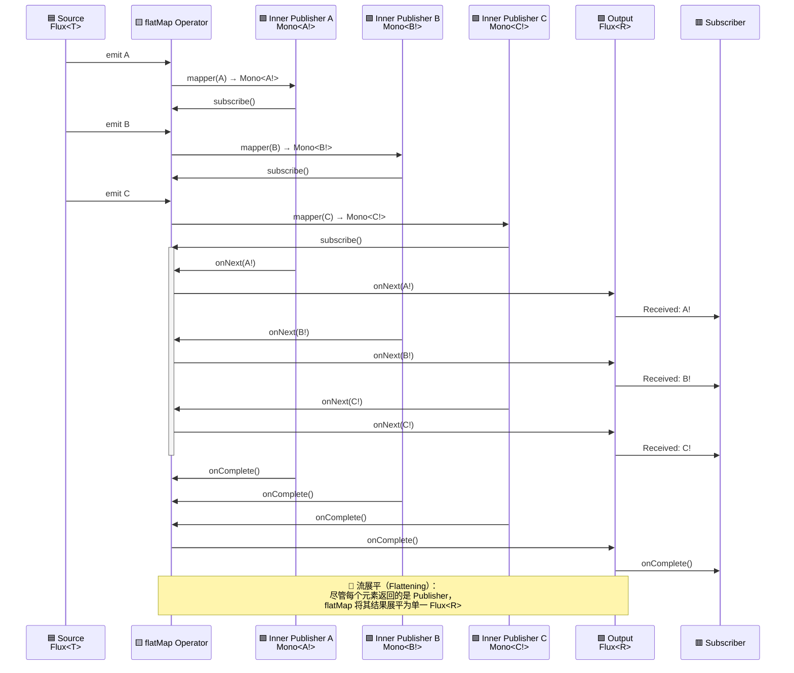

# Project Reactor 入门分享

### 前言

响应式编程是一种关注于数据流（data streams）和变化传播（propagation of change）的异步编程方式。 

Reactive Streams，是响应式系统的跨平台、跨库通用协议，是一种 规范

- 定义响应式流的标准接口
  -   `Publisher<T>`, `Subscriber<T>`, `Subscription`, `Processor<T,R>`
- 规范**非阻塞背压机制**


Publisher:发布者，负责发布数据流中的元素。

Subscriber: 订阅者，接收并处理发布者发布的元素。

Subscription:订阅，表示订阅者与发布者之间的连接，订阅者可以使用它来请求元素或取消订阅。

Processor:处理器，既是发布者又是订阅者，可以转换或处理数据流。





https://www.reactive-streams.org/

[Reactor中文文档](https://htmlpreview.github.io/?https://github.com/get-set/reactor-core/blob/master-zh/src/docs/index.html#getting-started-introducing-reactor)


### 简介

Project Reactor 是响应式编程范式的实现

-  实现 Reactive Streams 规范
  - 提供核心Publisher类型 `Flux` 和 `Mono`
  - 内建背压机制
- 支持丰富的操作符（`map`, `flatMap`, `filter`, `zip`, `merge` 等）
- 线程调度与异步执行能力
- 支持错误处理与流控制


#### 与传统的编程模式对比

一、响应式编程可以看作是 观察者模式的一种扩展。

传统的观察者模式：

```java
//被观察对象
interface Subject {
  // 多个观察者订阅这个对象
  void addObserver(Observer observer);
  void removerObserver(Observer observer);
  // 被观察对象状态变化，通知所有观察者
  void notifyObservers(String message);
}

// 观察者
interface Observer {
  void dosomething(String message)
}
```

响应式编程的扩展

1、数据流支持：不仅支持单个事件的通知，还支持连续的数据流

2、操作符链：提供丰富的操作符来转换、过滤、组合数据流

3、背压处理：通过背压机制解决生产者和消费者速率不匹配的问题

4、错误处理、完成信号：Publisher可以推送错误/完成信号来终止响应式流。

5、资源管理：更好的资源管理和生命周期控制


二、响应式流和迭代器模式

传统的迭代器模式（PULL），“命令式”（imperative）编程范式

```java
List<String> list = Arrays.asList("a", "b", "c");
Iterator<String> iterator = list.iterator();
while (iterator.hasNext()) {
    String item = iterator.next(); // 主动拉取数据
    System.out.println(item);
}
```

- 消费者主动从数据源拉取数据
- 消费者控制数据获取的节奏

响应式流（PUSH），声明式（declaratively）

- 数据源主动将数据推送给消费者
- 生产者控制数据推送节奏（但受背压机制制约）


三、总结

响应式编程结合了观察者模式和迭代器模式的优点，并在此基础上进行了重要扩展：

- 从观察者模式继承了事件驱动的特性，但增强了数据流处理能力

- 从迭代器模式借鉴了数据遍历的概念，但改变了数据获取方式（Push vs Pull）

- 增加了背压处理、丰富的操作符、完善的错误处理等新特性

这种设计使得响应式编程特别适合处理异步数据流、实时数据处理和高并发场景


### 生命周期

一、组装时

- 构建复杂的元素处理流程
- 不变性，每个被使用的操作符都会生成一个新对象。

在响应式库中，构建执行流程的过程被称为组装。


在组装时可以干什么：优化和监控流

- 通过检查流的类型来一个接一个的替换操作符，对流的链路进行优化
- 在组装过程中 为流提供一些Hooks，并启用一些额外的日志记录、跟踪、度量收集


二、订阅时

当调用指定 Publisher 的 subscribe 方法时，就会发生订阅。

在构建执行流程中，会对Publishers进行传递，产生了Publishers链。

当我们调用subscribe()方法时，信号在链条上开始传播:

- 订阅信号向上游传播 - 从最后一个操作符开始，向数据源方向传播订阅信号
- 数据信号向下游传播 - 从数据源开始，经过每个操作符处理后，向订阅者方向传播数据
- 完成/错误信号向下游传播 - 当流完成或发生错误时，相应信号也向下游传播


三、运行时

在 Publisher 和 Subscriber之间进行实际信号交换。

响应式流规范规定，Publisher 和 Subscriber 交换的前两个信号是 onSubscribe()信号和 request()信号

- 必须先请求再接收: Subscriber必须先调用request()方法，否则Publisher不会发送任何数据
- 信号顺序: 信号严格按照规范顺序发送，保证了流的正确性
- 背压控制: 通过request()机制，Subscriber可以控制数据流速，防止被数据淹没
- 信号交换是双向的：
  - Publisher → Subscriber: onSubscribe(), onNext(), onComplete()/onError()
  - Subscriber → Publisher: request(), cancel()


```
Publisher                  Subscriber
    |                          |
    |<----- subscribe() -------| (1) 订阅开始
    |                          |
    |---- onSubscribe(s) ----->| (2) 发送Subscription
    |                          |
    |<------ request(n) -------| (3) 请求n个元素
    |                          |
    |------- onNext(d) ------->| (4) 发送数据
    |------- onNext(d) ------->| (5) 发送更多数据
    |                          |
    |<------ request(m) -------| (6) 再次请求m个元素
    |                          |
    |------- onComplete ------>| (7) 或onError发送完成/错误信号

```


##### tip

通常我们直接 Publisher调用subscribe方法， 并没有手动创建Subscriber。

此时Reactor内部会创建一个Subscriber实现，自动发送request信号。

- 内部Subscriber会在onSubscribe()方法中自动调用subscription.request(Long.MAX_VALUE)
  - 这会请求Publisher发送所有可用数据

```java
Flux.just("x", "y", "z")
    .map(String::toUpperCase) // 随便一些操作
    .subscribe(
        System.out::println,           // onNext
        Throwable::printStackTrace,    // onError
        () -> System.out.println("Completed") // onComplete
    );
```





### 调度器概述

调度器是 Reactor 中用于控制操作执行线程和执行方式的组件。调度器可以用于切换执行上下文，可将耗时操作从主线程中移出，提高应用程序的响应性和吞吐量。

#### Reactor内部现成的四种主要调度器

##### 1. Schedulers.immediate()

Schedulers.immediate()是最简单的调度器，它不进行任何线程切换。提交给这个调度器的任务会在当前线程立即执行。

实现原理：

- 不创建新的线程，直接在当前线程执行任务
- 适用于快速、非阻塞的操作
- 实现简单，开销最小

使用场景：

- 快速计算或转换操作
- 不涉及任何阻塞或耗时操作的场景

示例代码：

```java
@GetMapping(value = "/immediate", produces = MediaType.TEXT_EVENT_STREAM_VALUE)
public Flux<String> immediateScheduler() {
    return Flux.range(1, 5)
            .map(i -> {
                String threadName = Thread.currentThread().getName();
                return "数据 " + i + " 在线程 " + threadName;
            })
            .subscribeOn(Schedulers.immediate()) // 在当前线程执行
            .map(data -> data + " -> 使用 immediate 调度器");
}
```

##### 2. Schedulers.single()

Schedulers.single() 是一个全局单线程调度器，所有使用该调度器的任务都会在同一个线程中执行。

实现原理：

- 使用单个可重用线程执行所有任务
- 所有调用共享同一个线程，直到调度器被销毁
- 任务按顺序执行，保证了任务间的顺序性

使用场景：

- 轻量级、非并行的任务
- 需要全局顺序执行的场景

示例代码：

```java
@GetMapping(value = "/single", produces = MediaType.TEXT_EVENT_STREAM_VALUE)
public Flux<String> singleScheduler() {
    return Flux.range(1, 5)
            .publishOn(Schedulers.single()) // 使用单线程调度器
            .map(i -> {
                String threadName = Thread.currentThread().getName();
                return "数据 " + i + " 在线程 " + threadName;
            })
            .delayElements(Duration.ofSeconds(1)); // 添加延迟以便观察
}
```

##### 3. Schedulers.boundedElastic()

Schedulers.boundedElastic() 是一个有界弹性线程池，通常用于处理 I/O 密集型和阻塞操作。

实现原理：

- 创建可重用的线程池，如果线程长时间空闲会被回收
- 有线程数量和任务队列大小的限制（默认线程数为 CPU 核心数 × 10，最大任务队列数为 100,000）
- 当所有线程都在忙时，新任务会被放入队列等待

使用场景：

- I/O 密集型任务（如文件读写、数据库操作、网络请求）
- 阻塞操作
- 需要弹性伸缩线程数量的场景

示例代码：

```java
@GetMapping(value = "/bounded-elastic", produces = MediaType.TEXT_EVENT_STREAM_VALUE)
public Flux<String> boundedElasticScheduler() {
    return Flux.range(1, 5)
            .publishOn(Schedulers.boundedElastic()) // 使用有界弹性调度器
            .map(i -> {
                // 模拟阻塞操作
                simulateBlockingOperation();
                String threadName = Thread.currentThread().getName();
                return "阻塞操作 " + i + " 在线程 " + threadName + " 完成";
            })
            .delayElements(Duration.ofSeconds(1));
}
```

##### 4. Schedulers.parallel()

Schedulers.parallel() 是一个固定大小的线程池，线程数与 CPU 核心数相同，适用于 CPU 密集型任务。

实现原理：

- 创建固定数量的线程（通常等于 CPU 核心数）
- 适用于并行处理任务
- 线程会一直存在，不会被回收

使用场景：

- CPU 密集型计算任务
- 可以并行处理的任务
- 需要充分利用 CPU 资源的场景

示例代码：

```java
@GetMapping(value = "/parallel", produces = MediaType.TEXT_EVENT_STREAM_VALUE)
public Flux<String> parallelScheduler() {
    return Flux.range(1, 10)
            .publishOn(Schedulers.parallel()) // 使用并行调度器
            .map(i -> {
                // 模拟CPU密集型操作
                simulateCpuIntensiveOperation();
                String threadName = Thread.currentThread().getName();
                return "CPU计算 " + i + " 在线程 " + threadName + " 完成";
            })
            .delayElements(Duration.ofMillis(500));
}
```

##### tip

Reactor 同时提供 `newXXX(...)` 系列自定义创建方法（如 `newSingle()`、`newParallel(nThreads)`、`newBoundedElastic(...)` 等）, 可满足复杂业务场景下对线程资源的精细化控制需求。

- 例如`Schedulers.newSingle()` 与 `Schedulers.single()` ：`single()` 全局共享，而 `newSingle()` 每次创建独立单线程调度器，避免不同串行任务相互阻塞。


#### Worker

Reactor 的调度器采用 Worker 模式实现，每个调度器可以创建多个 Worker 实例。

**Worker 是 Reactor 实现“异步编程”的最小执行单元**，它让你无需关心线程创建与管理，只需声明“这个操作应该在哪个调度器上执行”，剩下的交给 Worker 来完成。 

Worker 的核心作用：

1. **任务执行单元**：Worker 是调度器的工作单元，负责实际执行任务
2. **线程绑定**：每个 Worker 绑定一个线程或线程池
3. **串行保障**：同一个 Worker 保证任务串行执行
4. **资源管理**：管理线程生命周期和任务队列


#### 调度器操作符

subscribeOn 和 publishOn 是 Reactor 中两个重要的调度器操作符，用于控制响应式流在哪个线程上执行。

**subscribeOn**

- 指定整个流的执行上下文（线程），影响数据源的执行线程。

特点：

- 通常用于指定数据流的初始执行线程，影响从源头开始的整个操作符链
- 通常只使用一次，在流的任何位置调用效果相同


**publishOn**

- 改变后续操作符的执行线程，可以多次使用

特点：

- 只影响其后的操作符
- 可以在流中多次使用，用于在流的不同阶段切换线程


### 核心操作符

#### flatmap

- **作用**：将 `Flux<T>` 中的每个元素转换为一个 `Publisher<R>`，然后将所有这些“内部流”**并发合并**成一个单一的 `Flux<R>`。
- **核心特性**：异步、展平、并发处理（不保证顺序）。
- `concurrency`: 并发订阅的 inner publisher 数量（默认 `Queues.SMALL_BUFFER_SIZE`，通常是 256）
- `prefetch`: 每个 inner publisher 预取的元素数量（默认 `Queues.XS_BUFFER_SIZE`，通常是 32）

```java
public final <R> Flux<R> flatMap(Function<? super T, ? extends Publisher<? extends R>> mapper) {
		return flatMap(mapper, Queues.SMALL_BUFFER_SIZE, Queues
				.XS_BUFFER_SIZE);
	}
```

##### 核心概念

##### inner publisher

在Reactor的flatMap操作符中，inner publisher（内部发布者）是指由上游每个元素转换而来的新Publisher。这些Publisher被称为"内部"的，因为它们是由flatMap操作动态创建和管理的，而不是来自外部的数据源。

1. 动态创建
    每个上游元素都会触发一个新的inner publisher的创建：
2. 并发执行
    所有的inner publisher会同时运行，而不是顺序执行：

##### 异步展平

> 异步展平是将每个元素触发一个异步任务（返回 Publisher）的过程，通过操作符（如 `flatMap`）自动订阅这些任务，并将它们的结果合并成一个单一、非阻塞、支持背压的输出流。

| **异步（Asynchronous）** | 不阻塞主线程，任务完成后通过事件通知结果                 |
| ------------------------ | -------------------------------------------------------- |
| **展平（Flattening）**   | 把“流的流”（`Flux<Flux<T>>`）变成“单一的流”（`Flux<T>`） |
| **操作对象**             | 每个元素都会触发一个异步任务（返回`Mono<T>`或`Flux<T>`） |

示例：

```java
Flux.just("A", "B", "C")
    .flatMap(s -> Mono.just(s + "!"))
    .subscribe(result -> System.out.println("Received: " + result));
```

