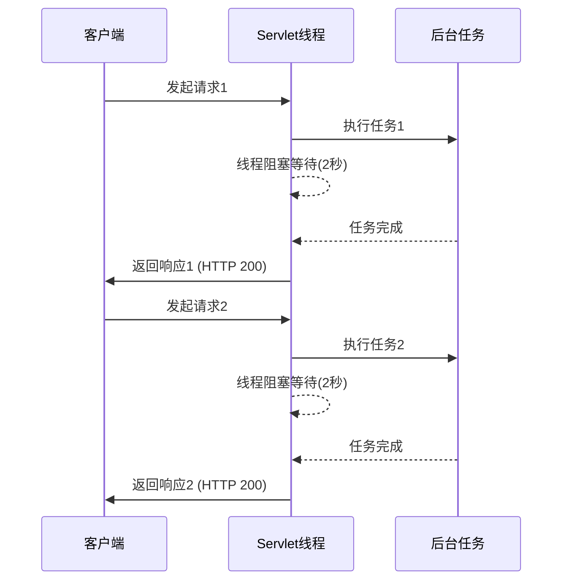
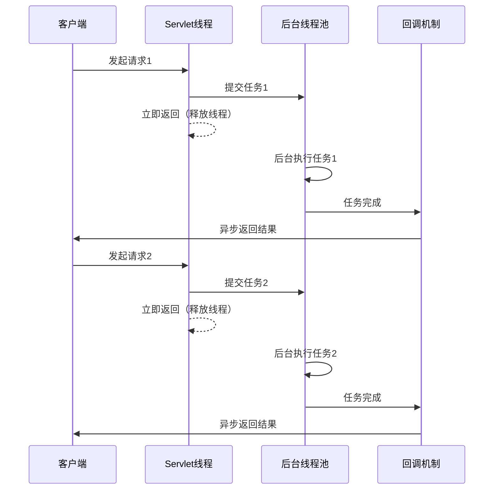

# 阻塞 vs 非阻塞方式线程使用对比

## 阻塞方式线程模型



在阻塞方式中，每个请求都会占用一个Servlet线程直到任务完成，线程无法处理其他请求。

## 非阻塞方式线程模型



在非阻塞方式中，Servlet线程快速提交任务后立即释放，可以处理更多请求，但HTTP响应仍然在任务完成后返回，状态码为200。

## 线程池使用对比

### 阻塞方式线程使用情况

```mermaid
gantt
    title 阻塞方式线程使用情况 - 处理3个并发请求
    dateFormat  ss
    section Servlet线程1
    请求1处理: 00, 02
    section Servlet线程2
    请求2处理: 00, 02
    section Servlet线程3
    请求3处理: 00, 02
```



### 非阻塞方式线程使用情况

```mermaid
gantt
    title 非阻塞方式线程使用情况 - 处理3个并发请求
    dateFormat  ss
    section Servlet线程
    请求1接收: 00, 00
    请求2接收: 00, 00
    请求3接收: 00, 00
    空闲: 00, 02
    section 后台线程1
    任务1执行: 00, 02
    section 后台线程2
    任务2执行: 00, 02
    section 后台线程3
    任务3执行: 00, 02
```



## 线程数量对比

| 场景 | Servlet线程使用数 | 后台线程使用数 | 总线程数 | 并发处理能力 |
|------|-------------------|----------------|----------|--------------|
| 阻塞方式 | 与请求数相同 | 0 | 高(与请求数成正比) | 低(受限于Servlet线程池) |
| 非阻塞方式 | 少量(仅用于接收请求) | 与请求数相同 | 低(可控制) | 高(可处理大量并发) |

## Spring Boot对非阻塞线程的支持

### 1. 对CompletableFuture的原生支持

Spring Boot通过以下方式支持非阻塞处理：

```java
@RestController
public class AsyncController {
    // 直接返回CompletableFuture，Spring自动处理异步响应
    @GetMapping("/async")
    public CompletableFuture<String> handleAsync() {
        return CompletableFuture.supplyAsync(() -> {
            // 后台线程执行耗时操作
            return "AsyncResult";
        });
        // Servlet线程立即返回，不阻塞
    }
}
```

当控制器方法返回CompletableFuture时，Spring Boot会：
1. 立即释放Servlet线程
2. 在CompletableFuture完成后自动发送响应给客户端
3. 返回HTTP 200状态码（不是202）
4. 无需手动调用[get()](file://reactor/core/scheduler/Schedulers.java#L122-L122)方法阻塞等待

### 2. 对Reactive Streams的全面支持

Spring WebFlux提供了完整的响应式编程支持：

```java
@RestController
public class ReactiveController {
    // 返回Flux/Mono，Spring自动处理响应式流
    @GetMapping(value = "/stream", produces = MediaType.TEXT_EVENT_STREAM_VALUE)
    public Flux<String> handleStream() {
        return Flux.interval(Duration.ofSeconds(1))
                   .map(i -> "Message: " + i);
        // 支持服务端推送事件(SSE)
    }
}
```

### 3. 线程池管理

Spring Boot提供了多种线程池管理方式：

1. **内置调度器**：
   - `Schedulers.parallel()` - 用于CPU密集型任务
   - `Schedulers.boundedElastic()` - 用于I/O密集型任务
   - `Schedulers.single()` - 用于轻量级任务

2. **自定义线程池**：
```java
@Configuration
@EnableAsync
public class AsyncConfig {
    @Bean
    public Executor taskExecutor() {
        ThreadPoolTaskExecutor executor = new ThreadPoolTaskExecutor();
        executor.setCorePoolSize(4);
        executor.setMaxPoolSize(10);
        executor.setQueueCapacity(100);
        executor.setThreadNamePrefix("async-thread-");
        executor.initialize();
        return executor;
    }
}
```

## Future和CompletableFuture的作用

### 1. Future的作用

Future是Java 5引入的接口，代表异步计算的结果：

```java
// 传统Future使用方式
ExecutorService executor = Executors.newFixedThreadPool(10);
Future<String> future = executor.submit(() -> {
    // 执行耗时任务
    return "Result";
});

// 阻塞等待结果（不推荐在Web请求中使用）
String result = future.get(); 
```

**局限性**：
- 只能通过[get()](file://reactor/core/scheduler/Schedulers.java#L122-L122)方法阻塞获取结果
- 不支持链式操作
- 不支持多个Future的组合
- 不支持回调机制

### 2. CompletableFuture的作用

CompletableFuture是Java 8引入的Future增强版：

```java
// CompletableFuture的优势
CompletableFuture<String> future = CompletableFuture.supplyAsync(() -> {
    return "Result";
}).thenApply(result -> {
    // 链式操作
    return result + " processed";
}).thenCompose(result -> {
    // 组合其他异步操作
    return CompletableFuture.supplyAsync(() -> result + " combined");
});

// 非阻塞方式使用
return future; // Spring Boot自动处理，返回HTTP 200
```

**优势**：
- 支持非阻塞回调处理
- 提供丰富的链式操作方法
- 支持多个异步操作的组合
- 内置异常处理机制

### 3. 在Spring Boot中的应用

Spring Boot对Future和CompletableFuture的支持：

```java
@RestController
public class FutureController {
    private final Executor executor = Executors.newFixedThreadPool(10);
    
    // 阻塞方式（不推荐）
    @GetMapping("/future-blocking")
    public String handleFutureBlocking() throws Exception {
        Future<String> future = CompletableFuture.supplyAsync(() -> {
            return "Result";
        }, executor);
        
        // 阻塞等待结果（浪费线程资源）
        return future.get();
    }
    
    // 非阻塞方式（推荐）
    @GetMapping("/future-nonblocking")
    public CompletableFuture<String> handleFutureNonBlocking() {
        return CompletableFuture.supplyAsync(() -> {
            return "Result";
        }, executor);
        // Servlet线程立即释放，但HTTP响应仍为200状态码
    }
}
```

## 关键优势

1. **资源利用率**：
   - 非阻塞方式显著提高了Servlet线程的利用率
   - Servlet线程可以快速处理更多请求

2. **系统扩展性**：
   - 非阻塞方式可以使用少量线程处理大量并发请求
   - 避免线程池耗尽问题

3. **响应时间**：
   - 非阻塞方式可以立即接收请求，减少客户端等待时间
   - 实际任务处理在后台进行

4. **Spring Boot原生支持**：
   - 直接返回CompletableFuture/Mono/Flux即可实现非阻塞处理
   - 无需手动管理线程和回调
   - 默认返回HTTP 200状态码，如需202需手动设置